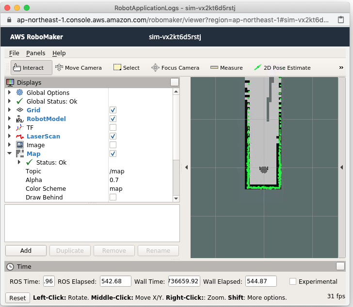
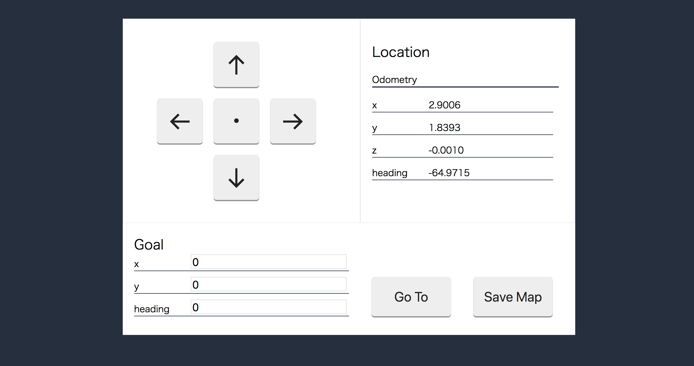
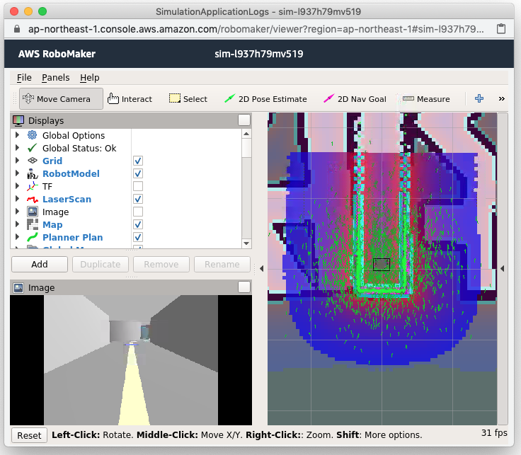
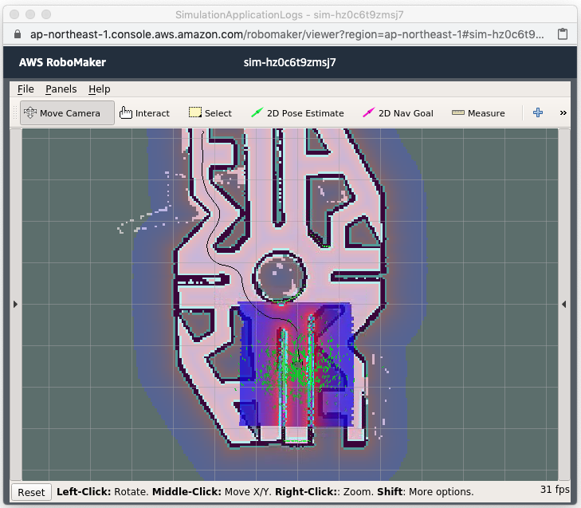

# Create map and navigate robot to designated location in RoboMaker simulator

コンテスト参加者向け日本語のドキュメントが次にあります ([初心者クラス](contest/docs/howto-one-make.md), [カスタマイズクラス](contest/docs/howto-expert.md), [詳細](contest/docs/detail.md))

This is a sample application for [AWS Robot Delivery Challenge](https://aws.amazon.com/jp/robot-delivery-challenge/).

This sample application can create word map using SLAM and navigate the word by by using the map. This sample application provides a web user interface to control the robot in simulation world.

## Setup

You can setup the sample application on AWS RoboMaker development environment.

1. Create [RoboMaker development environment](https://console.aws.amazon.com/robomaker/home#ides). Select **Melodic** as the Pre-installed ROS distribution.

2. Download this sample application to the development environment by executing following command in the terminal window of the development environment.

    ```bash
    git clone https://github.com/aws-samples/aws-robomaker-sample-application-delivery-challenge.git
    ```

3. On the same terminal window, execute following commands.

    ```bash
    cd ~/environment
    cd aws-robomaker-sample-application-delivery-challenge
    ./ws_setup.sh
    ```

4. After all the setup process completed (it takes around 20-30 min), download the browser folder under aws-robomaker-sample-application-delivery-challenge directory to your local file system. You can do this by right click the browser folder and select [**Download**] from the context menu.

5. Extract the file you just download. This is the web interface which you can control the robot running in simulation world.

## How to use

This sample application provides two functionalities. One is creating map and the other is navigating the world. Let's create map first.

### Create map

1. A shell script to launch application in RoboMaker simulation is created when you executed set up shell script *ws_setup.sh*. In terminal window, execute following shell script to launch application in RoboMaker simulation with map creation mode.

    ```bash
    ./launch_slam.sh 
    ```

    (The shell script should exist under the same directory you executed *./ws_setup.sh*)

2. Go to [RoboMaker simulation in AWS Management console](console.aws.amazon.com/robomaker/home). You will find a simulation job under Preparing or Running status, open the simulation job. Simulation job detail page will be displayed.

3. CLick [**Connect**] button of [**GZClient**]. It shows the simulation world.

    

4. Click [**Connect**] button of [**Robot Application**] panel. It will bring the visualize tool for the robot's sensing data.

    

    From browser folder you download, find fine named *robot_controller.html*. Open the file with your web browser, it shows remote controller interface.

    

    By moving the robot by pressing arrow buttons in the controller, you can build the map of the world. (The generated map is displayed in the terminal window)

    When you are fine for the map, press [Save Map] button in the remote controller interface. The map file will then be saved into Amazon S3 bucket. The bucket the map is stored is described in the *robot_ws/src/delivery_robot_sample/settings/settings.yaml file*.

 5. Cancel the simulation by selecting *Actions* -> *Cancel* from the detail page of the simulation job.

### Navigate the world

1. A shell script to launch application in RoboMaker simulation is created when you executed set up shell script *ws_setup.sh*. In terminal window, execute following shell script to launch application in RoboMaker simulation with navigation mode.

    ```bash
    ./launch_navigation.sh 
    ```

    (The shell script should exist under the same directory you executed *./ws_setup.sh*)

2. Go to [RoboMaker simulation in AWS Management console](console.aws.amazon.com/robomaker/home). You will find a simulation job under Preparing or Running status, open the simulation job. Simulation job detail page will be displayed.

3. CLick [**Connect**] button of [**GZClient**]. It shows the simulation world. This time moving objects are also apper.

    

4. Click [**Connect**] button of [**Robot Application**] in **Robot application tools**. It will bring the visualize tool for the robot's sensing data.

    

5. Open the remote controller interface again. Set the designated location like x: 7.2, y: 2.3, heading: 0 in Goal section of the controller. Click [[G]o To] button, then. The robot will then create the navigation route to go to the location and the robot auto drive to the location.

    

Robot may stuck in the middle to avoid to collide the obstacles. It's time for tuning. You can tune the navigation parameters. They are in 
 **robot_ws/src/turtlebot3/turtlebot3_navigation/param**.
About the tuning points, you can find them from http://emanual.robotis.com/docs/en/platform/turtlebot3/navigation/#tuning-guide
When you make changes on your robot application, you should reflect the change to the application. You can do it by selecting, *Run* -> *Workflow* -> *Delivery Challenge Robot app build -> bundle* from the menu.

## Clean up

- Remove development environment [RoboMaker development environment](https://console.aws.amazon.com/robomaker/home#ides)
- Remote AWS resources, the setup script (ws_setup.sh) created. In [CloudFormation](https://console.aws.amazon.com/cloudformation) stack You will find two stack names starting from **deliverychallenge**. They are the stacks this sample application created for creating the resources necessary for running this sample program. Delete them to remove the resources.

## License

This library is licensed under the MIT-0 License. See the LICENSE file.

