# HOW TO - AWS Robot Delivery Challenge 2021 初心者部門

ここでは AWS Robot Delivery Challenge 初心者部門の予選にエントリーするための手順を説明します。

## 1.作業環境を用意する

まずは、コンテストに参加するための作業環境を用意します。今回コンテストでは AWS RoboMaker という AWS のサービスを作業環境として活用します。AWS RoboMaker はロボットのアプリケーションを開発する方に向けた様々な機能を提供しています。これはロボット工学の研究者や、開発者が実際に利用をしているサービスですが、これから説明する手順にしたがって作業をすすめれば皆さんも利用をすることができます。是非この機会にロボット工学の一端に触れてみましょう。

### 1.1 AWS RoboMaker 開発環境を作成する

AWS RoboMaker 開発環境はロボットアプリケーションを開発するための開発環境をクラウドに提供したものです。次の手順でコンテスト向けの開発環境を用意します。

1. AWS マネジメントコンソール [https://console.aws.amazon.com/](https://console.aws.amazon.com/) を開きます。(AWS Educate アカウントからの AWS マネジメントコンソールへの入り方は AWS Educate のドキュメントを確認してください)

2. サービス一覧から 「AWS RoboMaker」を見つけて開きます。URL: [https://console.aws.amazon.com/robomaker](https://console.aws.amazon.com/robomaker) から直接 AWS RoboMaker を開くこともできます。 

3. AWS RoboMaker の機能の一覧から [**開発**] → [**開発環境**] を選びます。機能の一覧は画面左側に表示されていますが、これが表示されていない場合は、左上に「≡」ボタンが表示されていると思うので、これをクリックします。

4. 開発環境の一覧が開かれます。リスト右上の [**環境の作成**] ボタンをクリックします。開発環境の作成のための入力画面が開始します。

    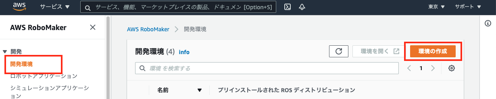

5. 開かれた 「**AWS RoboMaker 開発環境を作成する**」 ウインドウでは「**名前**」は開発環境の名前を任意に設定します(例：deliverychallenge2021) 。「**プリインストールされた ROS ディストリビューション**」は 「**Melodic**」 を選びます。「**インスタンスタイプ**」は 「**m5.large**」 を選択、「**VPC**」 はリストから **(デフォルト)** と表示されているものを選び「 **サブネット** 」は任意の１つを選びます。一通り入力したら右下の [**作成**] ボタンをクリックして、開発環境の作成を開始します。

    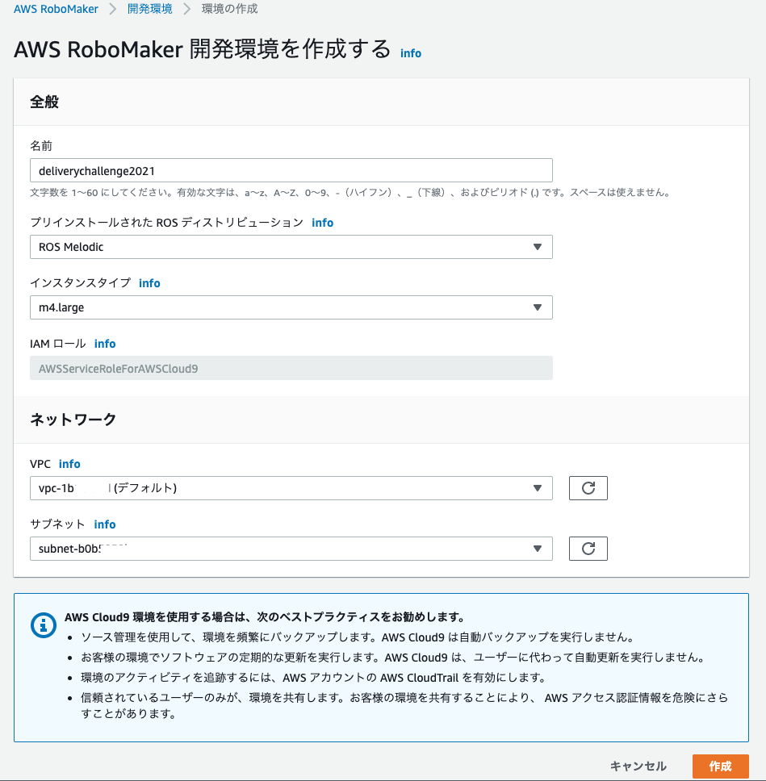

6. 開発環境の作成が開始されます。作成の完了には数分かかります。

    開発環境作成、接続中

    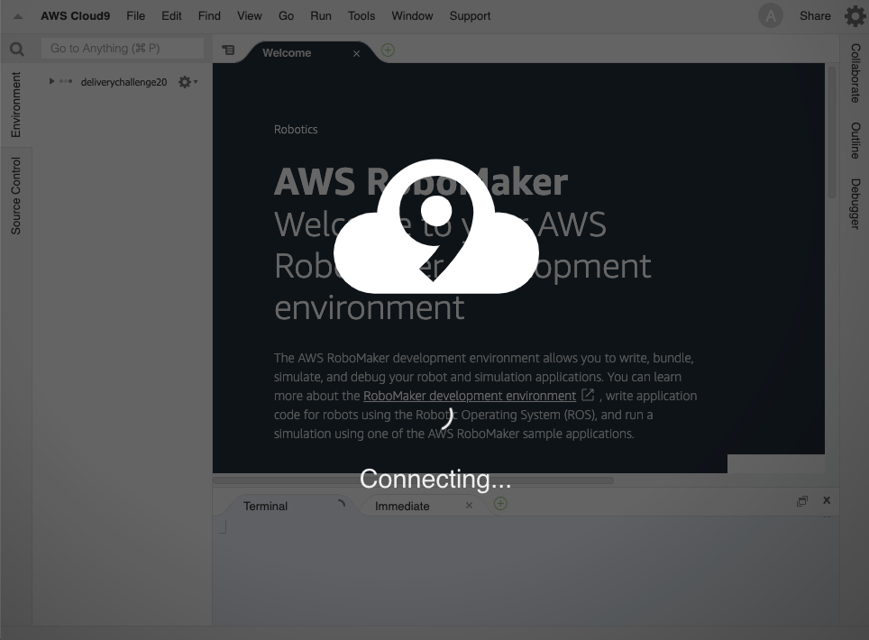

    作成、接続完了

    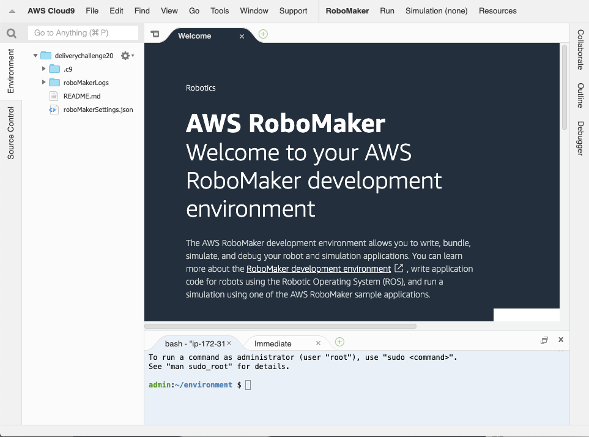

> ※ 開発環境はブラウザーを閉じてもファイルの内容などについては以前の状況を維持しています。ブラウザーを閉じた後、再び同じ開発環境に戻るためには AWS RoboMaker の機能の一覧から [**開発**] → [**開発環境**] を選び、出てきた開発環境一覧の中から該当の項目を選んで開きます。

### 1.2 AWS RoboMaker 開発環境にコンテスト用の素材を取り込み、利用可能にする

開発環境にコンテスト用の素材をダウンロードしてきて、利用可能にしていきます。次の手順にしたがって作業を行ってください。

1. AWS RoboMaker 開発環境の画面右下のターミナル領域をクリックします。

    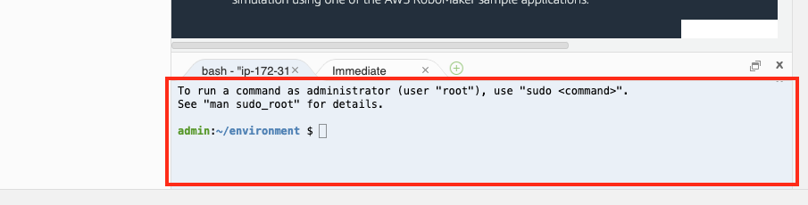

2. ターミナル領域に次の内容を入力します。これはインターネットからコンテストの素材をダウンロードしてきています。

    ```bash
    git clone https://github.com/aws-samples/aws-robomaker-sample-application-delivery-challenge.git
    ```

    （最後まで入力したら [**Enter**] キーを押します)

3. 続いて次を入力して実行します。

    ```bash
    cd aws-robomaker-sample-application-delivery-challenge/contest/one-make
    ```

    （最後まで入力したら [**Enter**] キーを押します)

4. さらに次を入力して実行します。コンテストの環境の構築が開始されます。これは完了まで 10分ほどかかります。完了までしばらくお待ちください。

    ```bash
    ./onemake_setup.sh 
    ```

    （最後まで入力したら [**Enter**] キーを押します)

    コマンド完了後の表示

    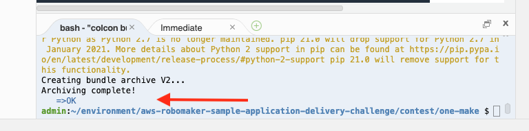


5. **(注：この操作は先に実行したコマンドが正常に完了したことを確認してから行います)** ロボットを遠隔操作するための Webインターフェースをご自身の PC にダウンロードします。画面左側のファイルツリーで **aws-robomaker-sample-application-delivery-challenge** を開き、この中の **browser** フォルダーを右クリックして、メニューを開きます。現れたメニューから **Download** を選択します。

    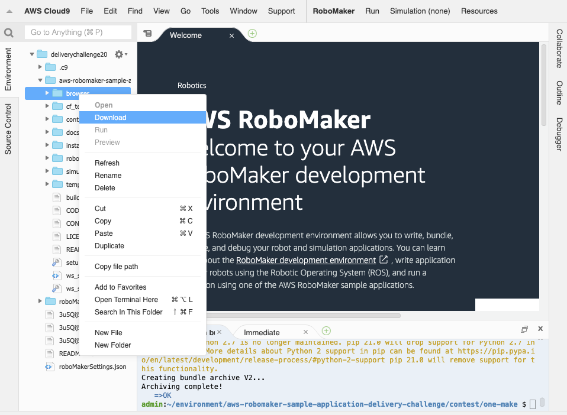

6. フォルダーの内容は一つのアーカイブファイルとしてご自身の PC にダウンロードされてきます。**アーカイブファイルは展開して**それぞれのファイルを開けるようにしておいてください。後ほど使います。

    これで準備は完了です。コンテスト用のロボットアプリケーションが利用可能になりました。次にアプリケーションの使い方を説明していきます。

## 2. ロボットアプリケーションの使い方（シミュレーション）

予選はシミュレーション環境でロボットを操作してタイムを競います。まずシミュレーションの起動のしかたと基本操作を覚えましょう。次の指示にしたがって作業を進めてください。

1. AWS RoboMaker 開発環境のメニューから **Run** → **Launch Simulation** → **Delivery Challenge Navigation** を選択します。シミュレーションの開始が要求されます。

    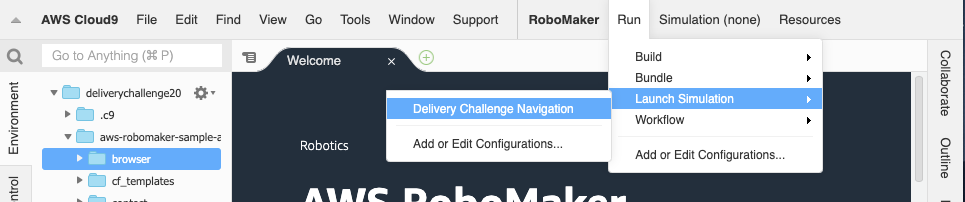

2. シミュレーションは開始まで数分かかります。メニューの Simulation の表示が Simulation (Preparing) となったらこのメニューを開いてください。中の View Simulation Job Details という項目が選択できるはずです。これを選択します。要求されたシミュレーション（シミュレーションジョブといいます）の詳細画面が開かれます。

    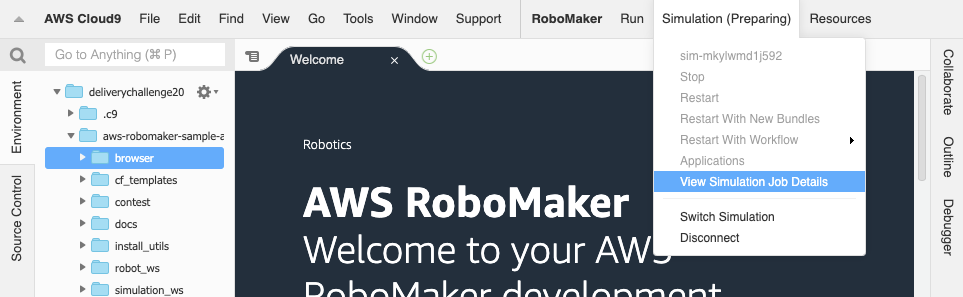

3. シミュレーションジョブ詳細画面では「**ステータス**」が「**実行中**」となるまでお待ちください。「実行中」に変わるとシミュレーションジョブの中で使えるツール機能のパネルが表示されてきます。

    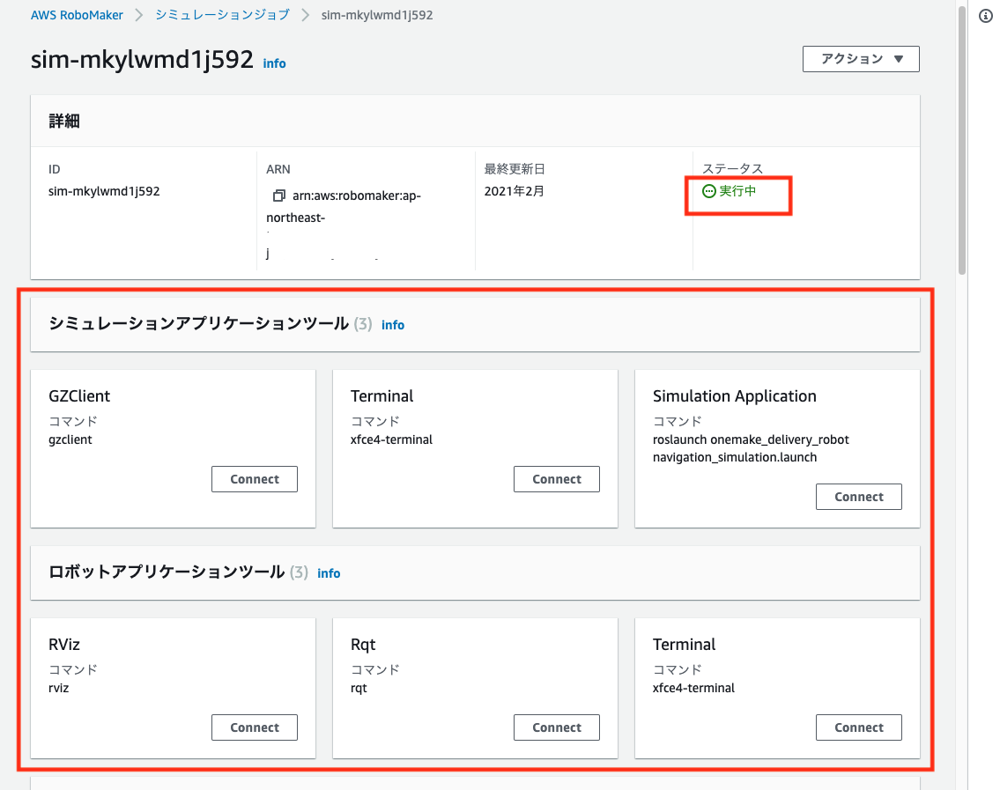

4. 「**シミュレーションアプリケーションツール** 」の中にある[**GZClient**] の [**Connect**] ボタンをクリックしてください。シミュレーションの画面が開かれてきます。画面右下に見えているがあなたが操作するロボットです。

    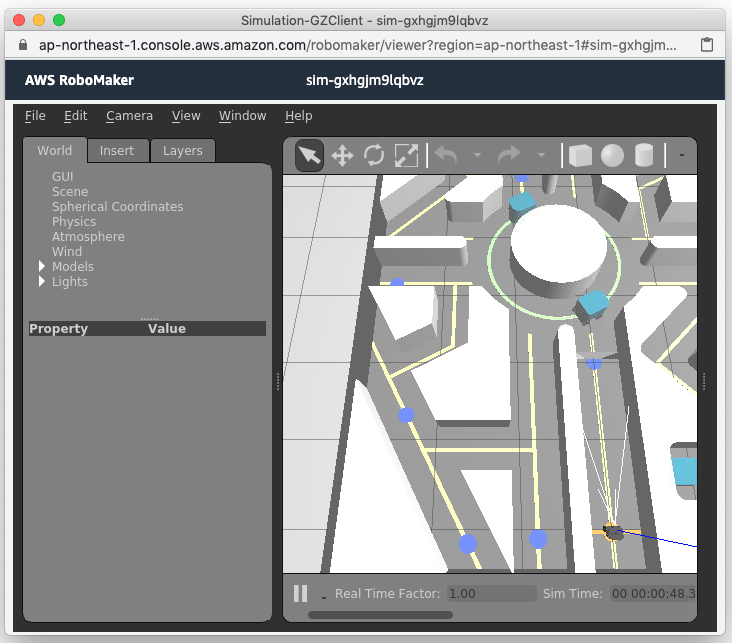

5. 視点の変え方などの操作に慣れてください。マウスホイールで拡大、縮小ができます。マウスを左クリックしながらドラッグすることで表示を平行移動できます。[Shift] キーを押しながらマウスを左クリックしてドラッグすることで表示を回転させることができます。

6. 「**シミュレーションアプリケーションツール** 」の中にある[**Simulation Application**] の [**Connect**] ボタンをクリックしてください。ここでは **Rviz** というツールによってロボットが認識している情報を視覚化した画面が開かれてきます。GZClient はシミュレーションの世界であるのに対し Rviz はロボットが周辺をどう理解しているかを視覚化したものです。Rviz では地図と地図の中でロボットがどこに位置しているかを表示し、また周辺の領域が走行可能かどうかの判定を青は安全、赤は危険で表示し、センサーが捉えている周辺の障害物の情報を緑色の点で表示、緑色の矢印は地図の中でどこにいるかを判定する際の基準を表示しています。ロボットが正常に動作している間はシミュレーションワールドと Rviz の表示はかなり連動していますが、ロボットが転倒するなど不測な状況が発生することにより両者の間に大きな差が生じる場合もあります。画面の左下にはロボットに搭載されたカメラからの画像も確認することができます。

    

7. Rviz についても視点の変え方などについての操作に慣れておいてください。Rviz では マウスホイールで拡大、縮小ができます。[Shift] キーを押しながらマウスを左クリックしてドラッグすることで表示を平行移動できます。(GZClient とは少し操作方法が異なっています)

8. ロボットを動かしてみましょう。今回のアプリケーションでは専用の Webインターフェースを提供しています。先ほど 「1.2 AWS RoboMaker 開発環境にコンテスト用の素材を取り込み、利用可能にする」でダウンロード、展開したご自身の PC の中にある browser フォルダーを開き、この中にある **robot_controller.html** というファイルをブラウザーで開いてください。ロボットをコントロールするための Webインターフェースが開かれます（Webブラウザーは Google Chrome を推奨します)

    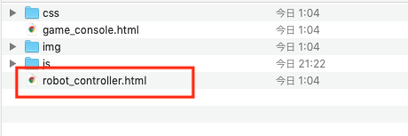

    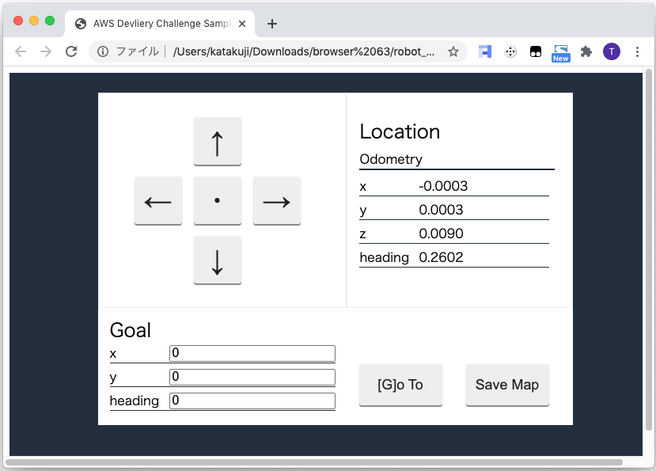
    
    それぞれ操作に慣れてください

    * 矢印ボタンを押すことでロボットを移動させることができます。矢印の真ん中の「・」を押すことで停止させることができます。またキーボードの矢印キーでも操作できます。矢印キーは押している間その方向に移動し、離すと停止します。
    * 右上の Location の下の表示は現在のロボットの位置を示しています。シミュレーション画面を開いた最初の表示で ロボットの直進方向が x、左右の方向が y、ロボットの向きが反時計回りで heading で表示されています。床に格子状にひかれている線はひとつのマスが 1 (m) になります。

    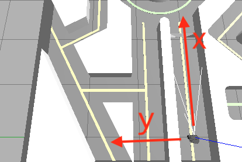

    * **Goal** はロボットを自動走行させる時の目標地点を設定します。右上 Location の値と同じ座標系でロボットを到達させたい場所の座標と向きを設定します。
    * [**[G]o To**] ボタンをクリックするか、キーボードの [**G**] ボタンを押すことで Goal で設定された地点への自動走行を開始します。自動走行機能は今回のシミュレーション環境用に特別なチューニングは行っておらず、ロボットの標準パラメータを使っています。このため通路の細い場所などではうまく走行ルートを通れない場合があります。このような場合、マニュアル操作に切り替えて走行を補助してあげる必要があるでしょう。矢印キーボードまたは矢印ボタンでマニュアル操作をすると自動走行はキャンセルされます。自動走行を再開させるには再度 [**[G]o To**] ボタンをクリックするか、キーボードの **G** を押します。
    * 自動走行をさせている時の **rviz** の表示を確認してみてください。ロボットの走行計画が黒い線でひかれて、これに沿ってロボットは移動を試みます。ロボットには周辺の障害物を捉える  LiDAR センサーが搭載されており、周辺 360度の障害物を捉えています。移動の途中で障害物が検出された場合、障害物を避ける走行ルートを作成し、ルートを調整して走行を試みます。Rviz はロボットがどういう計画で動作をしているのかを理解し、予測するのに役に立つでしょう。

    

    * マニュアル操作は自動運転と比べて遅い走行速度に設定されており、この速度は変更することはできません。ロボットをいかに早く目的地に到達させるかは、自動運転をいかに有効に活用できるかに関わっています。
    * [**Save Map**] ボタンはカスタマイズ部門の方が利用する機能になります。現在起動しているアプリケーションでは機能しません。

9. シミュレーションでの作業が一通り終わったらシミュレーションジョブの詳細画面 **[アクション]** -> **[キャンセル]** を選んでシミュレーションジョブを終了させます。 シミュレーションは使った時間と処理の重さに応じた従量課金（処理の重さにも依存しますが、１時間使って約 $3）です。不要に長くシミュレーションを起動したままにして、クレジットを使い果たさないように気をつけてください！　なお明示的にキャンセル操作をしなくともシミュレーション起動後 30分で自動的に停止するように設定されています。

    


## 3. シミュレーション予選

Robot Delivery Challenge 予選はシミュレーションを利用したタイムトライアルです。指定された場所にいかに短時間で到達できるかを競います。専用の測定ツールが用意され、結果は自動通知されます。ここではシミュレーション予選でのタイム計測の方法について説明します。

### チェックポイントについて

まずチェックポイントを説明します。チェックポイントは次の図に示した場所になります。これは座標で示すと x: **7.2**, y: **2.3** のあたりになります。

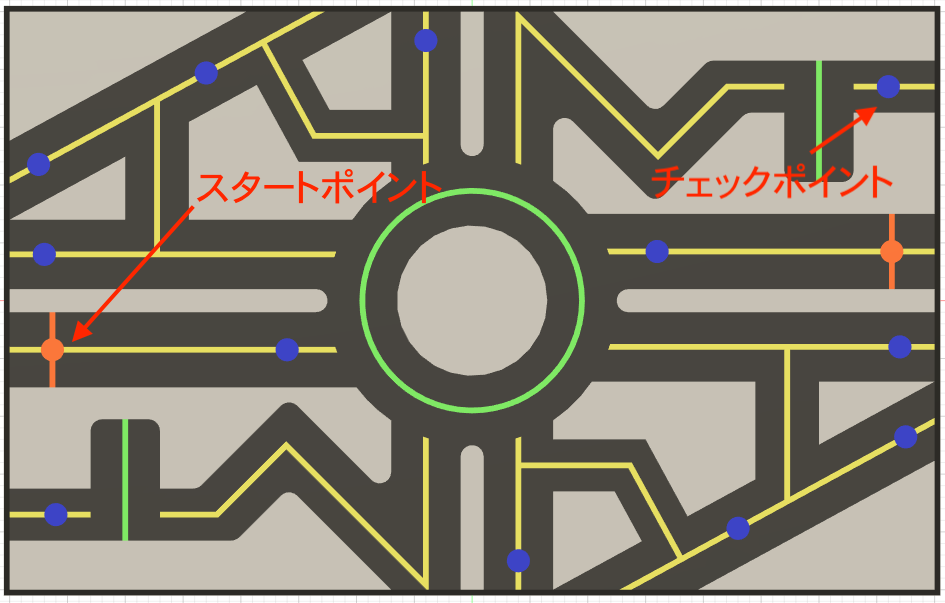

### タイム計測

ここではシミュレーション予選のタイム計測方法を説明します。シミュレーションのタイム計測は何度でも行うことができます。一番良いタイムがチームのタイムとして採用されます。

1. まずシミュレーションを開始して、Webインターフェースから操作可能な状態を整えておいてください。
2. Webインターフェースを開始したのと同じフォルダーの中にある **game_console.html** というファイルをブラウザーで開いてください。予選タイム計測ツールが開かれます。

    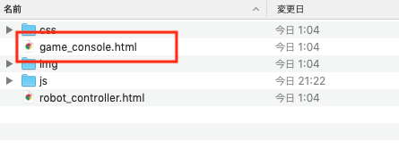

    

3. 「チーム代表の Emailアドレス」にチーム登録を行った際の代表者の Email アドレスを入力して [Enter]　キーを押してください。正しい メールアドレスであれば、ステータスが Ready となり計測を開始することができます。

    (コンテストへの参加申請をいただいてから計測システムに情報が反映されるまで1日程度時間がかかります。もし申請から数日経過してもメールアドレスで認証されないようであれば事務局([aws-robot-delivery-challenge@amazon.com](mailto:aws-robot-delivery-challenge@amazon.com))まで状況確認の連絡をしてください）

    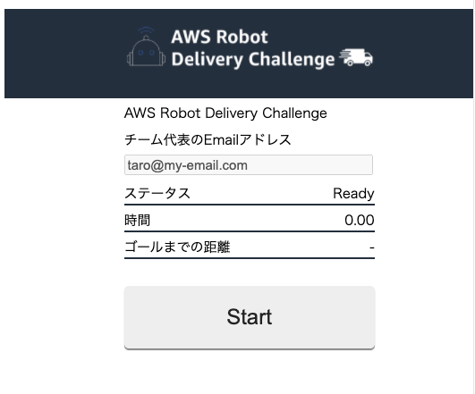

4. [**Start**] ボタンをクリックすることで計測を開始することができます。ステータスは **Running** に変わります。（ロボットは [**Start**] ボタンをクリックすると同時に強制的にスタート地点に戻されます。ロボットがスタート地点以外にいる場合、このロボットの位置の強制リセットによりロボットがスタート地点以外にいた場合、ロボットの内部地図との間にズレがでてきてしまう可能性があります。[Start]　ボタンを押す前に、ロボットはスタート位置につかせておくことが推奨されます）

5. Webインターフェースを使ってロボットをコントロールしチェックポイントを目指してください。経過時間とゴールまでの距離は計測ツールに表示されます。

    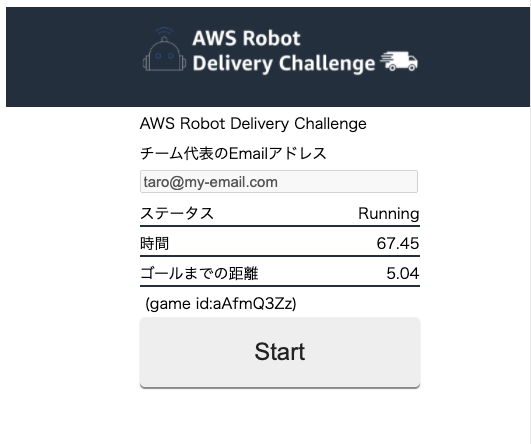

6. チェックポイントに到達すると計測が終了し、結果が自動的に通知されます。結果の通知が無事終了するとステータスは Reported となります。この画面は記録のためにスクリーンショットなどを取っておくことを推奨します。最新の順位は AWS Robot Delivery Challenge Webページで報告されます。

    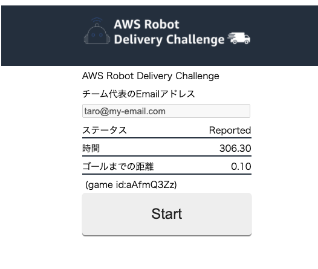

    (計測後に表示されるランキングは全ての計測結果の中でのランキングです。チーム順位はAWS Robot Delivery Challenge Webページで確認してください)

決勝に進めるのは上位５チームとなります。決勝では実際のロボットを操作します。決勝はフィールドに２チームが入り、複数あるチェックポイントをどれだけ通過することができるかを競うポイント競技になります。ぜひみなさん、決勝目指して頑張ってください！
