# AWS Robot Delivery Challenge 環境構築について

(2020/5/29 更新)

# 目次
#### ロボットを動かしてみよう
  * [全体の流れ](#全体の流れ)
  * [AWS Robomakerの準備](#AWS-Robomakerの準備)
  * [アプリケーション環境の構築](#アプリケーション環境の構築)
  * [地図作成とナビゲーション](#地図作成とナビゲーション)
   
#### 予選リーグへの戦略を立てよう
  * [予選リーグ測定について](#予選リーグ測定について)
  * [アプリケーションコードの更新と実行](#アプリケーションコードの更新と実行)
    
#### 各ツールの操作のコツとチューニングポイント
  * [Gazeboについて](#Gazeboについて)
  * [Rvizについて](#Rvizについて)
  * [地図作りのコツ](#地図作りのコツ)
  * [マップ作成のチューニングポイント](#マップ作成のチューニングポイント)
  * [ナビゲーションのチューニングポイント](#ナビゲーションのチューニングポイント)

## ロボットを動かしてみよう
### 全体の流れ
ロボットをシミュレーション上で動かせるようになるまでの行程は大きく分けて3つあります。
まずは、AWSマネジメントコンソールからログインしてAWSRoboMaker用の開発環境を整えます。

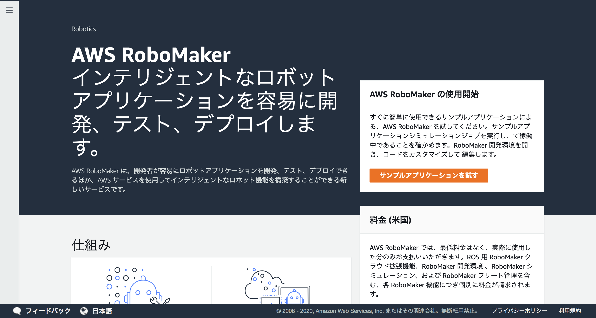

次に最初の開発環境内で数行コードを実行して（こちらのコードは用意してあります)アプリケーションの構築をします。最後に下の写真のような道をシミュレーション環境内でロボットに走らせてコントローラーを使って地図の作成と自動運転のテストをする、という流れです。


これから一つずつ説明していきます。

### AWS RoboMakerの準備
1. AWSマネジメントコンソール (https://console.aws.amazon.com/console/home) を開き、AWS RoboMakerサービスを開きます。
  
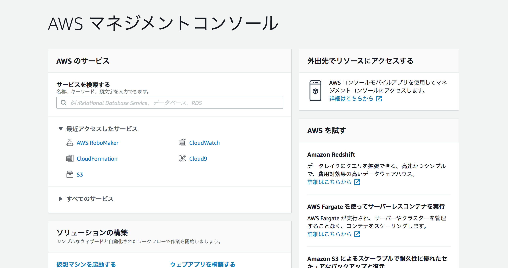

2. 左のナビゲーションペインから「開発環境」を選び [環境の作成] ボタンを押して開発環境の作成を開始します。

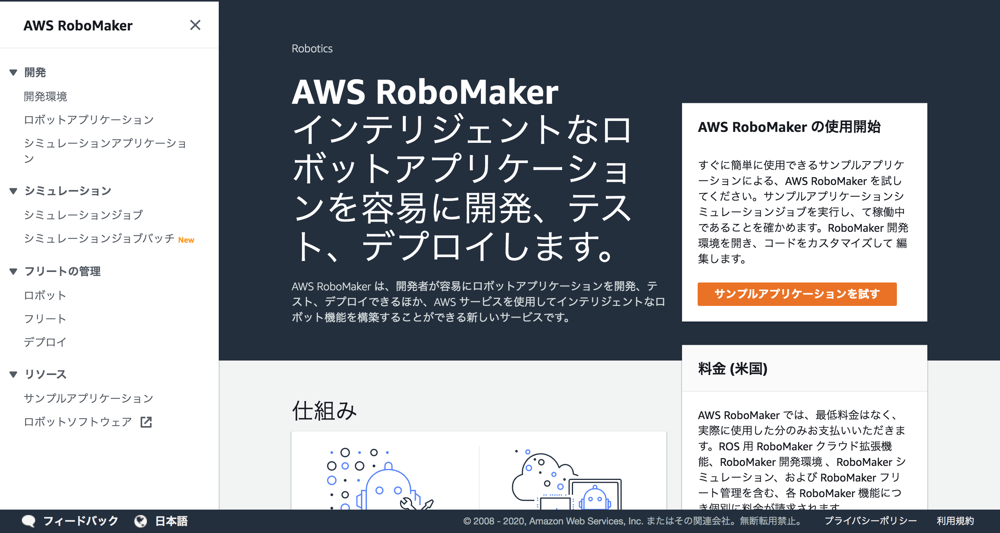

3. 開かれた 「AWS RoboMaker 開発環境を作成する」 ウインドウでは プリインストールされた ROS ディストリビューション は Kinetic か Melodic を選びます。インスタンスタイプはデフォルトの m4.large を選択、VPC はリストから (デフォルト) と表示されているものを選びサブネットは任意の１つを選びます。（選択するサブネットはパブリックサブネットである必要があります）

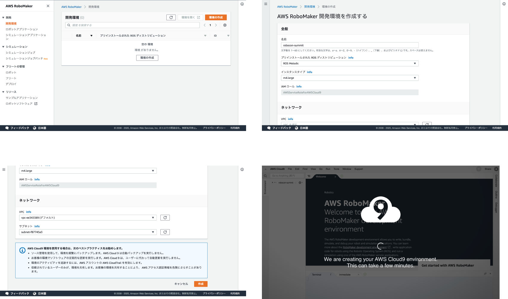

4. AWS のクラウドIDEサービス、AWS Cloud9 をベースに AWS RoboMaker用に機能拡張した開発環境が開きます。
5. 画面下側ターミナル領域で次のコマンドを実行します。今回のアプリケーションのコードがダウンロードされます。

    ```
    git clone https://github.com/aws-samples/aws-robomaker-sample-application-delivery-challenge.git
    ```

    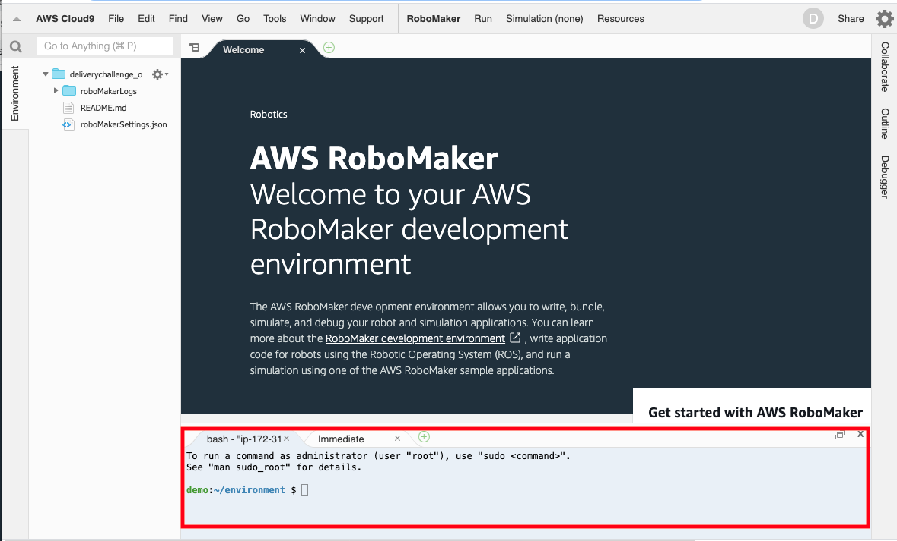


### アプリケーション環境の構築

1. ターミナル領域で次を実行して環境構築を開始します
  
    ```bash
    cd ~/environment
    cd aws-robomaker-sample-application-delivery-challenge
    ./ws_setup.sh
    ```

    アプリケーションの構築が開始されます。完了には 15分から30分ほどかかります。一通りの処理が終了するとターミナルは再び入力待ち状態になります。

    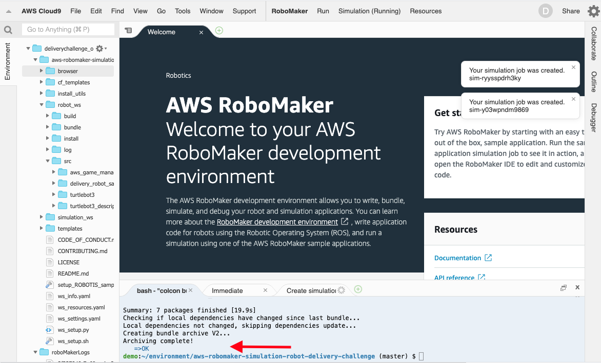

2. browserフォルダ右クリック、メニューから Download を選びます。ダウンロードしたファイルの browser/robot_controller.html にリモート操作などの機能が提供されます。Webブラウザーで開きます。
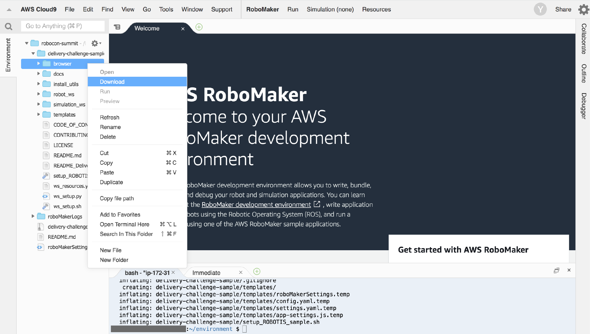

### 地図作成とナビゲーション
#### 地図の作成
1. 開発環境メニュー Run -> Launch Simulation -> Delivery Challenge controller を選択してシミュレーションジョブを開始します。
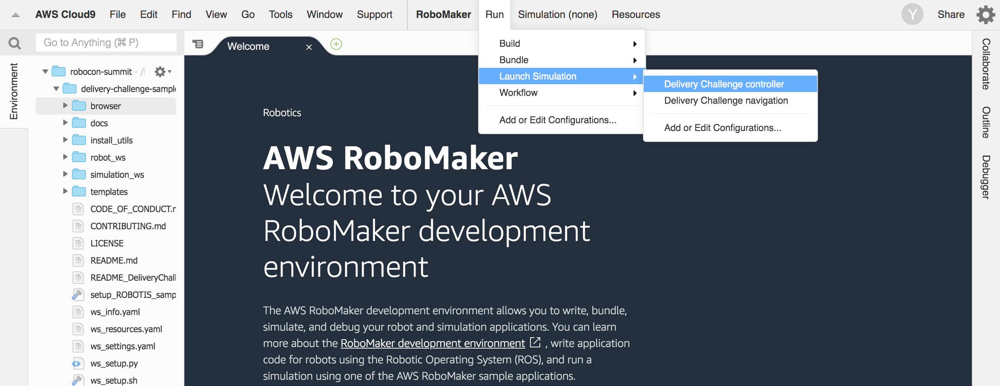
2. 開発環境メニュー Simulation -> View Simulation Job Details を開き起動したシミュレーションの詳細画面を開きます。
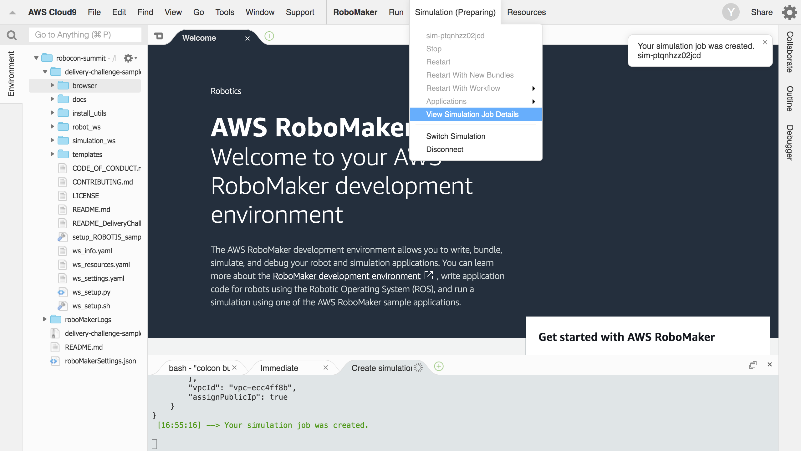
3. 詳細画面でステータスの表示が *実行中* になるまで待ちます。*実行中* になったら [Gazebo] アイコンの [Connect] ボタンをクリックすることでシミュレーション画面を開くことができます。シミュレーション内のロボットはブラウザーインターフェースを通じて操作することができます。
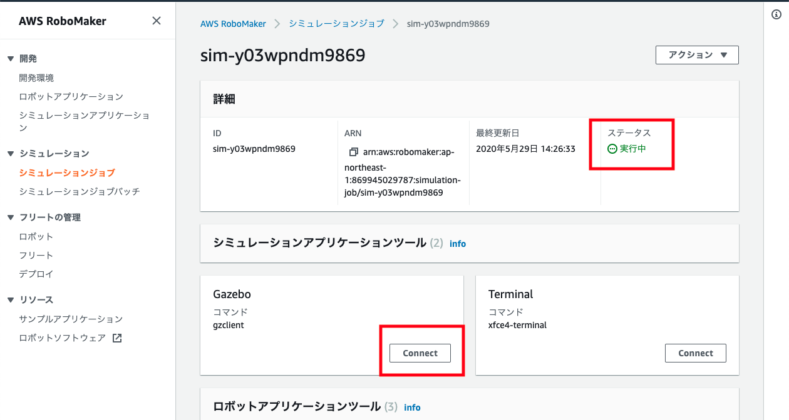
4. シミュレーションの詳細画面、**ロボットアプリケーションツール** にある [Terminal] を開きます。次を実行することでマップの作成を開始することができます。
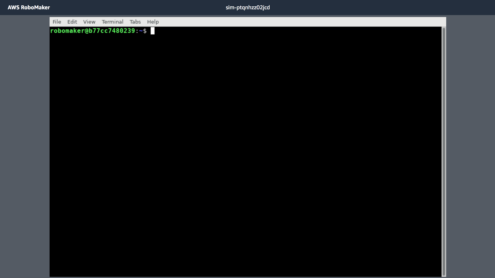

  ```bash
  export TURTLEBOT3_MODEL=burger
  roslaunch delivery_robot_sample slam.launch
  ```
5. ブラウザーインターフェースでロボットを操作して環境の地図を完成させます。環境の地図を作る、とはGazeboの画面をみながらロボットを操作して道路を一通り走らせることで、ターミナル画面に表示されている画面で道路に該当する部分を塗って行くことを指しています。
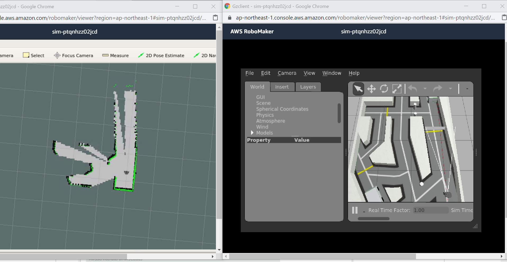
(Gazeboの操作について詳しくは [Gazeboについて](#Gazeboについて)を、地図の作り方について詳しくは[地図作りのコツ](#地図作りのコツ)を参照)

6. 地図が完成したらブラウザーインターフェースで [Save Map] ボタンをクリックします。地図情報は Amazon S3 に保存されます。（保存先バケット名は robot_ws/src/delivery_robot_sample/settings/settings.yaml で確認することができます)

7. 地図の保存がうまく行ったらシミュレーションジョブの詳細画面 [アクション] -> [キャンセル] を選んでシミュレーションジョブを終了させます。
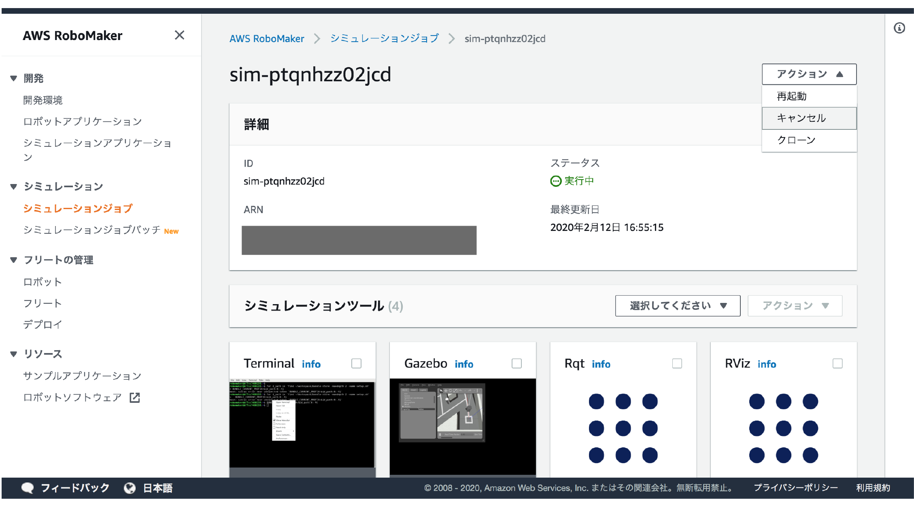

>シミュレーションは使った時間と処理の重さに応じた従量課金（処理の重さにも依存しますが、１時間使って約 $3）です。不要に長くシミュレーションを起動したままにして、クレジットを使い果たさないように気をつけてください！　なお、シミュレーションは起動時の設定で 1時間半たてば自動終了するように設定されています。この時間の調整は roboMakerSettings.json ファイルを編集することにより可能です。

#### ナビゲーション
地図が保存されたら、保存された地図を使って指定された場所への自動走行が可能になります。
1. 開発環境メニュー Run -> Launch Simulation -> Delivery Challenge navigation を選択してシミュレーションジョブを開始します。
2. 開発環境メニュー Simulation -> View Simulation Job Details を開き起動したシミュレーションの詳細画面を開きます。
3. [Gazebo] アイコンをクリックすることでシミュレーション画面を開くことができます。シミュレーション内のロボットはブラウザーインターフェースを通じて操作することができます。
4. (オプション) シミュレーションの詳細画面 **ロボットアプリケーションツール** の中にある[Terminal] からターミナルを開きます。次を実行することで自動計算されたナビゲーションルートやロボットが認識している周辺情報などを視覚化することができます。
 
  ```bash
  export TURTLEBOT3_MODEL=burger
  roslaunch delivery_robot_sample rviz_for_navigation.launch
  ```

  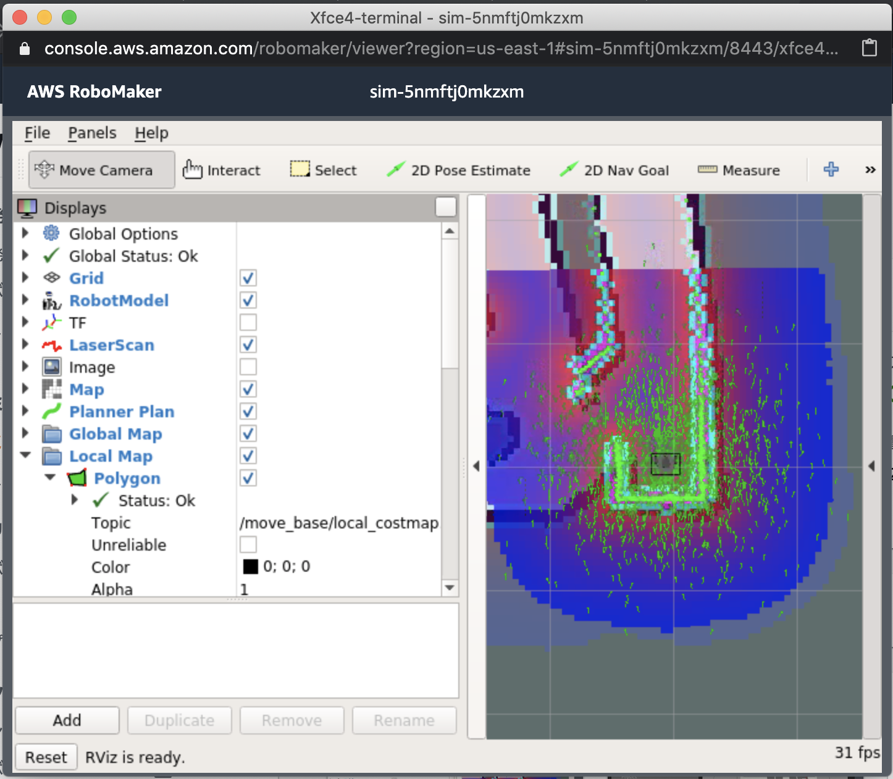

5. ブラウザーインターフェースで 「Goal」 に向かう場所の座標を入力します。 （現在のロボットの位置座標は ブラウザインターフェースの「Location」で確認することができます。あらかじめロボットを目標位置に移動させて、その場所の座標情報をメモしておくことで、その場所への移動を何度も繰り返すことができます）

6. ブラウザーインターフェースで 「Go To」 ボタンをクリックします。ロボットが、目標位置に向けて移動を開始します。

>シミュレーションでの作業が一通り終わったらシミュレーションジョブの詳細画面 [アクション] -> [キャンセル] を選んでシミュレーションジョブを終了させましょう。 シミュレーションは使った時間と処理の重さに応じた従量課金（処理の重さにも依存しますが、１時間使って約 $3）です。不要に長くシミュレーションを起動したままにして、クレジットを使い果たさないように気をつけてください！　なお、シミュレーションは起動時の設定で 1時間半たてば自動終了するように設定されています。この時間の調整は roboMakerSettings.json ファイルを編集することにより可能です。

### タイム計測方法
タイム測定はダウンロードしたブラウザーインターフェースの browser/game_console.html から行います。タイム計測を [Start] ボタンをクリックして開始します。[Start] ボタンをクリックするとロボットが初期位置に戻され、タイマーが開始します。ゴールに到着すると Status の表示が Finished に代わり、タイマーが止まります。

## 予選リーグへの戦略を立てよう
### 予選リーグ測定について
1. 予選リーグは RoboMaker のシミュレーション環境で指定された目的にまでの到着時間を競うタイムトライアルです。シミュレーションワールドの中で次の赤丸の場所を目指します。
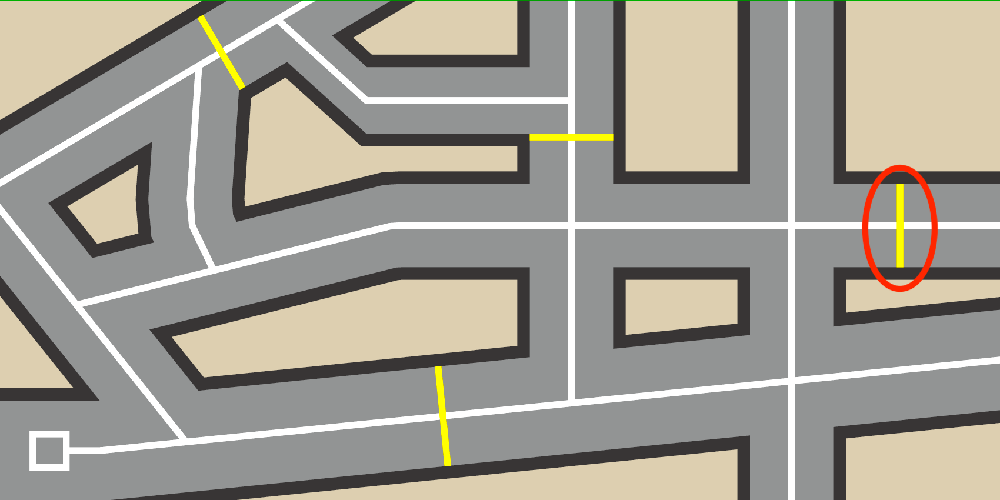

2. ブラウザーインターフェースの browser/game_console.htmlを開き、[タイム計測方法](#タイム計測方法)にあるようにタイムを計測します。ゴールに到着すると Status の表示が Finished に代わり、タイマーが止まります。この状態を、Gazebo の画面と合わせてスクリーンショットを結果として報告します。(下のような写真を送ってください。)

**注意： 計測中、リモートコントロールによって直接のロボットの移動速度を操作することは NG とします。測定開始後にナビゲーションでの座標指定や、運転を開始するためのコマンドを送ることは可能です**


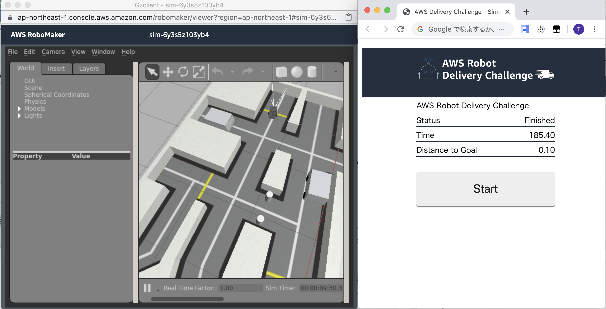
  
## アプリケーションコードの更新と実行
提供の地図を作る機能とナビゲーション機能はサンプルアプリケーションとして提供しています。サンプルアプリケーションとして提供されている箇所は robot_ws/src/delivery_challenge_sample 以下のファイルで、この箇所の変更は自由です。サンプルアプリケーションの中身の概要については 
[アプリケーションコードの詳細と改良の方法(Detail)](Detail.md) のドキュメントを参照してください。

## 各ツールの操作のコツとチューニングポイント
### Gazeboについて
[Gazebo] は3Dの物理的なシミュレーション機能を含むシミュレータです。ウィンドウのサイズは角をドラッグすることで変更することができます。シミュレーション画面の視点はマウスを使って変更することができます。
マウスでの視点の操作方法は次のページの一番下に説明されています。
http://gazebosim.org/tutorials?cat=guided_b&tut=guided_b2

### Rvizについて
「地図の作成」、「ナビゲーション」、それぞれの作業でターミナルでコマンドを入力した後に起動されるウィンドウは rviz と呼ばれるツールです。rviz はロボットが認識している情報を視覚化するツールです。今回の例では ロボットの LiDAR センサーが認識した障害物を赤い点(点群)で、また生成している地図を画像として表示しています。ウィンドウのサイズは角をドラッグすることで変更することができます。
マウスを使って視覚化されている画面の視点を調整することができます。左クリックしながらのマウスの移動で回転、[Shift] + 左ボタンで画面を上下左右に移動、右ボタンでズームをすることができます。

### 地図作りのコツ
地図画像の中で黒い場所が障害物で、無色の箇所は未知の領域です。地図はロボットに搭載されている LiDAR センサーからの情報をもとに作成されます。LiDARセンサーは周囲360度の障害物までの距離を測定することができるセンサーです。地図を作るために全てのルートを通過しなければならないというわけではありません。LiDAR センサーが壁を障害物として認識できれば、通過していない場所でもその場所の地図情報は形成されます。例えば狭くて通過が難しいルートがあった時、無理してそこを通過する必要はないかもしれません。その狭い道につながる別のルートがあれば、その別ルートから反対側に移動することにより、狭い通路を挟む周辺の地図をつくることができます。

ブラウザーインターフェースで [Save Map] ボタンをクリックするとファイルは一度 /tmp 配下に保存され、次に Amazon S3 に保存されます。 Amazon S3 での保存先は robot_ws/src/delivery_robot_sample/settings/settings.yaml ファイルで設定されています。

保存されるファイルは map.pgm と map.yaml ファイルの２つです。 map.pgm ファイルはグレースケールの画像ファイルで、作成された地図データになります。これは画像ファイルなので、画像編集ソフトで編集することも可能です。画像データの中で、黒い箇所が障害物として認識されます。例えば地図の中でロボットを走行させたくない領域がある場合、その周辺を黒く塗りつぶすことで、ロボットにそこに障害物があると解釈させることができます。大幅に変更するとロボットのセンサーが捉えた情報と地図が一致しなくなり、ロボットが自身の位置を判断することができなくなるので、行きすぎた編集には注意が必要です。

### マップ作成のチューニングポイント
マップの精度などに満足がいかない場合、例えば次のチューニングが考えられます。 

* gmapping 以外の SLAM の手法を利用する (SLAM そのほか用語については「サンプルアプリケーション各機能の内部仕様の概要」の「地図の作成」を参照してください）
    * サンプルアプリケーションは SLAM メソッドとして gmapping を利用しています。ROBOTIS サンプルプログラムは標準で gmapping 以外に cartographer, hector, karto, frontier_exploration に対応できるように作られています。これらを今回のサンプルアプリケーションの中で使うにはrobot_ws/src/delivery_robot_sample/launch/slam.launch  ファイルの slam_methods の値を変更し、またこのメソッドをアプリケーションの中にバンドルするよう、package.xml というファイルを編集済ます。
        * 例: cartographer を使う場合
        * robot_ws/src/delivery_robot_sample/launch/slam.launch、value を cartographer に
     
```
<launch>
  <include file="$(find turtlebot3_slam)/launch/turtlebot3_slam.launch">
    <arg name="slam_methods" value="cartographer"/>
  </include>
</launch>
```

* robot_ws/src/delivery_robot_sample/package.xml 、<exec_depend> に cartographer を加える

     
 ```
　　　　　　　　:　　　　　　　　：
        
  <!--  <exec_depend>slam_gmapping</exec_depend> -->
  <exec_depend>cartographer</exec_depend>
  <exec_depend>cartographer_ros</exec_depend>
  <exec_depend>cartographer_ros_msgs</exec_depend>
  <exec_depend>cartographer_rviz</exec_depend>
  <!-- <exec_depend>hector_mapping</exec_depend>
  <exec_depend>slam_karto</exec_depend>
  <exec_depend>frontier_exploration</exec_depend>
  <exec_depend>navigation_stage</exec_depend> -->
  </package>
```
 ファイルを変更したらビルド、バンドル作業をおこない、変更内容をロボットアプリケーションに反映される必要があります。方法は、Detailファイルで説明の「ビルド、バンドルを行う」、を参照してください。


### ナビゲーションのチューニングポイント
狭い道を通れずにロボットがスタックするなど、ナビゲーションがうまく行かない場合、例えば次のチューニングが考えられます。

* ナビゲーションの各パラメータを調整する
    * ナビゲーションスタックを起動する際、障害物からどこまでの範囲を通過できないエリアとして処理するかなどをパラメータ値で与えています。これらの値を調整することで、例えば狭い道を経路の候補から外させたり、通れるようにさせることができると考えられます。パラメータは robot_ws/src/turtlebot3/turtlebot3_navigation/param/costmap_common_param_burger.yaml の中にあります。
    * チューニングについて詳しくは次の ROBOTIS 社のサイトを参考にしてください。http://emanual.robotis.com/docs/en/platform/turtlebot3/navigation/#tuning-guide
    * ファイルを変更したらビルド、バンドル作業をおこない、変更内容をロボットアプリケーションに反映される必要があります。方法は、Detailファイルで説明の「ビルド、バンドルを行う」、を参照してください。
* 地図ファイルを編集する
    * 地図ファイルを画像編集ファイルなどで編集、更新して、ナビゲーションを最適化できる可能性があります。地図ファイルとして保存されているのは map.pgm と map.yaml ファイルの２つです。 map.pgm ファイルはグレースケールの画像ファイルで、作成された地図データになります。これは画像ファイルなので、画像編集ソフトで編集することも可能です。画像データの中で、黒い箇所が障害物として認識されます。例えば地図の中でロボットを走行させたくない領域がある場合、その周辺を黒く塗りつぶすことで、そこに障害物があると解釈させることができます。あまり大きく編集すると、ロボットのセンサーが捉えた情報と地図が一致しなくなり、ロボットが自身の位置を判断することができなくなるので、行きすぎた編集には注意が必要です。
    * robot_ws/src/delivery_robot_sample/settings/settings.yaml の s3_bucker の値が S3 で保存されているバケットの名前で、バケット内 s3_prefix で指定された場所に地図が保存されています。 https://s3.console.aws.amazon.com/s3 から該当するバケットにアクセス、ダウンロードと、アップロード、更新を行うことができます。地図はリアルタイムでロボットアプリケーションに反映させるわけではありません。更新したら、再度アプリケーションを起動して最新の地図でのナビゲーションを開始します。
